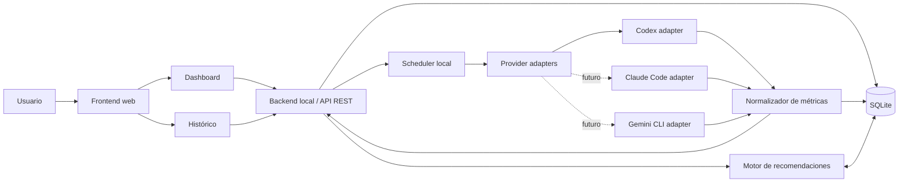

# Local AgentOps

> Observabilidad operativa local para coding agents.

Local AgentOps es una aplicación web local para observar el uso de agentes de programación, relacionarlo con jornadas, proyectos y sesiones, y convertir datos de distinta calidad en alertas y recomendaciones operativas. El MVP comienza con Codex autenticado mediante una cuenta ChatGPT y deja preparada una arquitectura extensible para Claude Code y Gemini CLI.

## Definición del producto

Local AgentOps es un sistema local de observabilidad y gestión operativa del uso de coding agents. No se limita a contar tokens: registra el contexto de trabajo, captura señales periódicas, conserva su procedencia y confiabilidad, muestra tendencias y ayuda a decidir si conviene continuar, reducir contexto, dividir una tarea, iniciar otra sesión, cambiar de agente o pausar.

La aplicación prioriza el procesamiento y almacenamiento local. Solo consulta fuentes soportadas o expuestas por cada provider y no supone que exista una API pública de consumo cuando esta no esté documentada o disponible para el modo de autenticación usado.

## Problema que resuelve

El uso diario de agent CLI en varios repositorios fragmenta la información necesaria para administrar una jornada:

- No existe una vista local centralizada del estado inicial y actual.
- Es difícil atribuir consumo a un proyecto, sesión, modelo o tipo de tarea.
- Los límites, contadores y estadísticas disponibles varían entre providers, planes y superficies.
- Un dato capturado o inferido puede confundirse con una cifra oficial.
- Las decisiones operativas suelen tomarse tarde, cuando aparece un rate limit o una sesión ya acumuló demasiado contexto.

Local AgentOps unifica esas señales sin ocultar su incertidumbre. Cuando no existe una métrica exacta, muestra una medida operativa restante o una estimación local claramente identificada.

## Objetivo general

Construir una aplicación web local que permita observar, medir, registrar, visualizar y gestionar operativamente el uso de coding agents durante la jornada laboral, iniciando con Codex como primer provider.

## Objetivos específicos

- Registrar el inicio, evolución y cierre de cada jornada de trabajo.
- Capturar snapshots periódicos de uso sin interrumpir el flujo del desarrollador.
- Asociar el consumo observable a proyectos y sesiones.
- Visualizar el estado diario y el margen operativo disponible o estimado.
- Analizar uso por proyecto, sesión, modelo y tipo de tarea.
- Diferenciar datos oficiales, capturados, estimados y manuales.
- Generar alertas y recomendaciones explicables.
- Construir un histórico diario, semanal y mensual.
- Mantener una arquitectura extensible para múltiples providers.

## Decisiones confirmadas

- El producto se llama **Local AgentOps**.
- La primera versión es una aplicación web local.
- Codex es el provider inicial.
- La autenticación inicial de Codex usa una **cuenta ChatGPT**, no una API key.
- La captura automática se ejecuta cada 5 minutos durante una jornada activa.
- El adapter consulta únicamente fuentes oficiales, documentadas o expuestas localmente por Codex.
- Ante la ausencia de métricas exactas, el sistema usa señales operativas o estimaciones locales.
- Cada métrica conserva su origen, estrategia de captura, calidad y nivel de confianza.
- Los fallos de una fuente no bloquean el dashboard ni detienen la jornada.
- La arquitectura nace preparada para integrar Claude Code y Gemini CLI.
- El producto no presupone ni promete una API pública completa de consumo de Codex.
- No se realiza scraping inseguro ni se eluden controles, permisos o términos de uso.

## Alcance del MVP

### 1. Inicio de jornada

El usuario puede iniciar una jornada diaria. La aplicación registra fecha y hora, provider activo, modo de autenticación y fuente de datos; intenta capturar un snapshot inicial y clasifica el estado en verde, amarillo, rojo o crítico.

Si no existe una fuente automática suficiente, el usuario puede ingresar un valor manual. El registro conserva la procedencia para que una cifra manual o estimada nunca se presente como oficial.

### 2. Medición automática cada 5 minutos

Un job local:

- Se activa únicamente cuando existe una jornada abierta.
- Consulta las fuentes habilitadas del provider activo.
- Guarda snapshots normalizados y, cuando sea seguro, el payload original.
- Actualiza los datos consumidos por el dashboard.
- Clasifica cada dato como oficial, capturado, estimado o manual.
- Vincula el snapshot con la sesión activa, si existe.
- Registra fallos de captura como eventos sin detener la jornada.

### 3. Sesiones por proyecto

Una sesión representa una unidad de trabajo con un agente. Al iniciarla se puede registrar:

- Proyecto local y ruta del repositorio.
- Rama Git actual.
- Provider y modelo.
- Identificador externo de sesión, cuando esté disponible.
- Objetivo y tipo de tarea.
- Hora de inicio y cierre.

Los snapshots capturados durante ese intervalo se asocian a la sesión. Al cerrarla, el backend calcula un resumen con duración, variación de métricas, eventos, calidad de los datos y recomendaciones relevantes.

### 4. Provider inicial: Codex

El primer adapter explorará, por orden de preferencia, datos que Codex exponga mediante mecanismos soportados o fuentes locales accesibles:

- Codex CLI y comandos documentados.
- Statusline o salidas estructuradas disponibles.
- Contadores de tokens y estadísticas de contexto.
- Estado de rate limits o disponibilidad, si se expone.
- Identificador de sesión.
- Modelo usado.
- Directorio actual y raíz del proyecto.
- Rama Git, obtenida localmente del repositorio.
- Dashboard o API oficial, únicamente si está disponible para la cuenta ChatGPT y su uso está documentado.
- Logs locales aptos para consumo, cuando su formato y acceso sean compatibles con el uso soportado.

Estas son **fuentes candidatas**, no garantías del MVP. El adapter declara sus capacidades en tiempo de ejecución y degrada de forma explícita cuando una señal no está disponible.

### 5. Dashboard diario

El dashboard muestra:

- Jornada y provider activos.
- Estado operativo actual.
- Uso acumulado observable del día.
- Hora, resultado y calidad del último snapshot.
- Sesiones activas y cerradas.
- Consumo por proyecto y tipo de tarea.
- Tendencia y velocidad de uso.
- Margen operativo restante, solo si existe una fuente confiable.
- Estimación local diferenciada cuando no hay un dato exacto.
- Alertas de consumo acelerado.
- Recomendaciones operativas y su justificación.

### 6. Motor de recomendaciones

Un motor de reglas evalúa métricas normalizadas, tendencia, calidad del dato y estado del provider. Sus recomendaciones son explicables y no se presentan como garantías de disponibilidad.

### 7. Histórico y analítica

El MVP conserva snapshots y sesiones para consultas diarias. La arquitectura y el modelo soportan agregaciones semanales y mensuales, comparación entre proyectos, horarios y tipos de tarea.

### 8. Preparación multi-provider

Todos los providers implementan un contrato común. Los datos específicos se preservan en el payload original, pero el dashboard consume métricas normalizadas para evitar acoplarse a Codex.

## Providers soportados

| Provider | Estado | Autenticación inicial | Alcance |
| --- | --- | --- | --- |
| Codex | MVP | Cuenta ChatGPT | Captura según capacidades locales u oficiales disponibles |
| Claude Code | Futuro | Por definir | Adapter bajo el contrato común |
| Gemini CLI | Futuro | Por definir | Adapter bajo el contrato común |

La presencia de un provider en esta tabla no implica que todos expongan las mismas métricas. La aplicación consulta y persiste capacidades por instalación y entorno.

## Métricas a medir

El sistema intenta obtener o derivar, según disponibilidad:

- Tokens de entrada, salida y total.
- Uso de ventana de contexto y variación entre snapshots.
- Consumo acumulado por jornada y sesión.
- Uso o margen restante.
- Estado y proximidad de rate limits.
- Velocidad de consumo y cambios de tendencia.
- Duración de jornada y sesiones.
- Provider, modelo, proyecto, rama y tipo de tarea.
- Errores, pausas, límites y otros eventos operativos.
- Calidad, confianza, frescura y fuente de cada dato.

Una métrica ausente es `null`, no cero. Las agregaciones no deben mezclar unidades incompatibles ni sumar estimaciones y cifras oficiales como si fueran equivalentes.

## Tipos de datos: oficial, capturado, estimado y manual

| Tipo | Definición | Ejemplo | Tratamiento |
| --- | --- | --- | --- |
| **Oficial** | Dato obtenido desde una API, dashboard, comando documentado o mecanismo soportado por el provider. | Estado de límite devuelto por una fuente oficial. | Mayor precedencia; conserva timestamp y fuente. |
| **Capturado** | Dato observado desde CLI, statusline, token counters, estadísticas de contexto, session id, salida del agente o logs locales. | Contador mostrado por una sesión local. | Se valida y conserva el método de extracción. |
| **Estimado** | Dato calculado localmente porque no existe una fuente exacta. | Proyección de agotamiento basada en la pendiente reciente. | Debe incluir método, ventana y confianza. |
| **Manual** | Dato ingresado por el usuario cuando no hay una fuente automática. | Disponibilidad registrada al iniciar la jornada. | Se identifica al autor y permite corrección. |

El campo `source_type` clasifica la procedencia. `data_quality` expresa confianza, completitud y frescura; ambos conceptos son independientes.

## Fuentes de datos consideradas

El adapter de cada provider mantiene una estrategia ordenada de fuentes y declara qué capacidad satisface cada una:

1. API, dashboard o comando oficial documentado.
2. Salida estructurada del CLI o integración soportada.
3. Statusline, token counters, context stats, rate limits y session metadata expuestos localmente.
4. Logs locales documentados y estables, con lectura mínima y sin datos sensibles innecesarios.
5. Metadata local independiente del provider: directorio, raíz Git y rama.
6. Estimación derivada de snapshots anteriores.
7. Entrada manual.

Los parsers deben ser versionados, tolerantes a cambios y probados con fixtures sanitizados. Los payloads pueden contener información sensible; la configuración debe permitir desactivar su persistencia o aplicar redacción antes de guardarlos.

## Arquitectura propuesta

Local AgentOps adopta una arquitectura modular local:

- **Frontend web:** interfaz de jornada, sesiones, dashboard, alertas e histórico.
- **Backend local:** API REST, casos de uso y coordinación de módulos.
- **Scheduler:** dispara capturas periódicas sin ejecutar lógica específica de providers.
- **Provider adapters:** encapsulan descubrimiento de capacidades, autenticación y captura.
- **Normalizador:** convierte datos heterogéneos a un contrato común y conserva procedencia.
- **SQLite:** almacena configuración, jornadas, sesiones, snapshots, eventos y recomendaciones.
- **Motor de recomendaciones:** aplica reglas sobre métricas normalizadas y calidad del dato.
- **Histórico:** realiza agregaciones temporales sin modificar los datos originales.
- **Configuración:** define providers, frecuencia, privacidad, retención y umbrales.

Principios de diseño:

- Backend y scheduler se ejecutan como un único proceso en el MVP, con módulos separados.
- Los adapters dependen de interfaces del dominio, no del frontend ni de SQLite.
- La captura es asíncrona, tiene timeout y aislamiento de errores por fuente.
- SQLite opera en modo WAL y las escrituras usan transacciones cortas.
- Solo una instancia del scheduler adquiere el lock local de captura.
- Toda recomendación conserva las señales y reglas que la originaron.
- La API escucha en `127.0.0.1` por defecto y no se expone a la red local sin configuración explícita.

## Diagrama Mermaid de arquitectura



## Stack tecnológico sugerido

### Opción principal

| Capa | Tecnología | Motivo |
| --- | --- | --- |
| Frontend | React + TypeScript + Vite | Ciclo local rápido, ecosistema maduro y separación clara del backend. |
| Backend | FastAPI + Python | API tipada, tareas asíncronas y buen soporte para procesos y parsers locales. |
| Persistencia | SQLite + SQLAlchemy + Alembic | Instalación mínima, migraciones y almacenamiento local transaccional. |
| Scheduler | APScheduler | Jobs configurables integrables con el ciclo de vida de FastAPI. |
| Gráficos | Recharts | Integración directa con React y suficiente para series temporales del MVP. |
| API | REST + OpenAPI local | Contrato simple, inspeccionable y desacoplado del frontend. |
| Configuración | YAML para opciones; `.env` para overrides y secretos | Legibilidad y separación entre configuración y credenciales. |
| Empaquetado | Docker Compose opcional | Entorno reproducible sin convertirlo en requisito para desarrollo local. |

### Alternativas

- **Node.js/NestJS** para un stack TypeScript de extremo a extremo.
- **Next.js** si se decide unificar frontend y endpoints, aunque añade complejidad innecesaria para el MVP local desacoplado.
- **Chart.js** como alternativa ligera para visualizaciones.
- **PostgreSQL** en una fase futura si aparecen múltiples usuarios, gran volumen o despliegue remoto.
- **Tauri** como opción desktop preferente por tamaño; **Electron** si prima la madurez del ecosistema.

## Modelo de datos inicial

Todas las fechas y horas se almacenan en UTC y se presentan en la zona horaria configurada. Los identificadores pueden implementarse como UUID. Los campos JSON requieren un esquema de aplicación versionado.

### `providers`

Catálogo e instancia configurada de providers.

| Campo | Tipo sugerido | Notas |
| --- | --- | --- |
| `id` | UUID / TEXT | Clave primaria. |
| `name` | TEXT | Nombre visible. |
| `type` | TEXT | `codex`, `claude_code`, `gemini_cli`. |
| `enabled` | BOOLEAN | Habilitación local. |
| `auth_mode` | TEXT | Por ejemplo, `chatgpt_account`. |
| `source_strategy` | JSON | Fuentes ordenadas y configuración no secreta. |
| `created_at` | DATETIME | Creación. |
| `updated_at` | DATETIME | Último cambio. |

### `provider_capabilities`

Capacidades descubiertas o configuradas por provider.

| Campo | Tipo sugerido | Notas |
| --- | --- | --- |
| `id` | UUID / TEXT | Clave primaria. |
| `provider_id` | UUID / TEXT | FK a `providers`. |
| `capability_name` | TEXT | Nombre estable, por ejemplo `context_usage`. |
| `capability_type` | TEXT | Estado, contador, límite o metadata. |
| `is_available` | BOOLEAN | Resultado del último discovery. |
| `confidence_level` | TEXT | `high`, `medium`, `low`, `unknown`. |
| `notes` | TEXT | Restricciones o causa de indisponibilidad. |

Restricción única sugerida: `(provider_id, capability_name)`.

### `projects`

| Campo | Tipo sugerido | Notas |
| --- | --- | --- |
| `id` | UUID / TEXT | Clave primaria. |
| `name` | TEXT | Nombre visible. |
| `repository_path` | TEXT | Ruta local normalizada; única cuando aplique. |
| `default_provider` | UUID / TEXT | FK opcional a `providers`. |
| `tags` | JSON | Etiquetas de clasificación. |
| `created_at` | DATETIME | Creación. |
| `updated_at` | DATETIME | Último cambio. |

### `workdays`

| Campo | Tipo sugerido | Notas |
| --- | --- | --- |
| `id` | UUID / TEXT | Clave primaria. |
| `date` | DATE | Fecha local de la jornada. |
| `started_at` | DATETIME | Inicio real. |
| `ended_at` | DATETIME | Nulo mientras esté activa. |
| `status` | TEXT | `active`, `closed`, `interrupted`. |
| `initial_state` | JSON | Estado normalizado inicial. |
| `current_state` | JSON | Proyección materializada para lectura rápida. |
| `notes` | TEXT | Notas del usuario. |

El MVP permite una sola jornada activa por instalación.

### `agent_sessions`

| Campo | Tipo sugerido | Notas |
| --- | --- | --- |
| `id` | UUID / TEXT | Clave primaria. |
| `workday_id` | UUID / TEXT | FK a `workdays`. |
| `provider_id` | UUID / TEXT | FK a `providers`. |
| `project_id` | UUID / TEXT | FK opcional a `projects`. |
| `session_external_id` | TEXT | ID del provider, si existe. |
| `model` | TEXT | Modelo observado o declarado. |
| `git_branch` | TEXT | Rama al iniciar. |
| `task_type` | TEXT | Categoría configurable. |
| `objective` | TEXT | Objetivo de trabajo. |
| `started_at` | DATETIME | Inicio. |
| `ended_at` | DATETIME | Cierre. |
| `status` | TEXT | `active`, `closed`, `interrupted`. |
| `summary` | JSON / TEXT | Resumen y calidad de la atribución. |

### `usage_snapshots`

| Campo | Tipo sugerido | Notas |
| --- | --- | --- |
| `id` | UUID / TEXT | Clave primaria. |
| `workday_id` | UUID / TEXT | FK a `workdays`. |
| `session_id` | UUID / TEXT | FK opcional a `agent_sessions`. |
| `provider_id` | UUID / TEXT | FK a `providers`. |
| `captured_at` | DATETIME | Instante de observación. |
| `source_type` | TEXT | `official`, `captured`, `estimated`, `manual`. |
| `source_name` | TEXT | Fuente concreta y versión del parser. |
| `data_quality` | JSON | Confianza, completitud, frescura y advertencias. |
| `input_tokens` | INTEGER | Nulo si no está disponible. |
| `output_tokens` | INTEGER | Nulo si no está disponible. |
| `total_tokens` | INTEGER | Nulo si no está disponible. |
| `context_usage` | REAL / JSON | Valor, unidad y alcance. |
| `rate_limit_status` | JSON | Estado, ventana y fuente. |
| `remaining_usage` | REAL / JSON | Valor y unidad; no asume porcentaje. |
| `raw_payload` | JSON / BLOB | Opcional, redactado y sujeto a retención. |

Índice sugerido: `(workday_id, captured_at)` y `(session_id, captured_at)`.

### `usage_events`

| Campo | Tipo sugerido | Notas |
| --- | --- | --- |
| `id` | UUID / TEXT | Clave primaria. |
| `session_id` | UUID / TEXT | FK opcional a `agent_sessions`. |
| `provider_id` | UUID / TEXT | FK a `providers`. |
| `event_type` | TEXT | Captura fallida, límite, cambio de estado, etc. |
| `severity` | TEXT | `info`, `warning`, `error`, `critical`. |
| `message` | TEXT | Descripción segura para UI. |
| `raw_source` | JSON | Detalle técnico redactado. |
| `created_at` | DATETIME | Momento del evento. |

### `recommendations`

| Campo | Tipo sugerido | Notas |
| --- | --- | --- |
| `id` | UUID / TEXT | Clave primaria. |
| `workday_id` | UUID / TEXT | FK a `workdays`. |
| `session_id` | UUID / TEXT | FK opcional a `agent_sessions`. |
| `recommendation_type` | TEXT | Acción sugerida estable. |
| `severity` | TEXT | Prioridad operativa. |
| `message` | TEXT | Recomendación visible. |
| `reason` | JSON / TEXT | Reglas y señales que la explican. |
| `created_at` | DATETIME | Generación. |
| `acknowledged_at` | DATETIME | Confirmación opcional. |

## API local propuesta

Prefijo inicial: `/api`. Las respuestas de error siguen un formato común con `code`, `message`, `details` y `request_id`.

| Método y ruta | Propósito |
| --- | --- |
| `POST /api/workdays/start` | Inicia una jornada, valida que no exista otra activa y solicita el snapshot inicial. |
| `POST /api/workdays/{id}/close` | Cierra sesiones abiertas según la política elegida, captura el estado final y genera el resumen diario. |
| `GET /api/workdays/current` | Devuelve la jornada activa, su estado y la frescura de los datos. |
| `POST /api/sessions/start` | Inicia una sesión y la asocia con jornada, provider, proyecto, rama, objetivo y tipo de tarea. |
| `POST /api/sessions/{id}/close` | Cierra una sesión y genera su resumen operativo. |
| `GET /api/sessions/current` | Lista las sesiones activas y su último snapshot asociado. |
| `GET /api/usage/today` | Entrega series y agregados de la jornada actual, conservando unidad y calidad. |
| `GET /api/usage/history` | Consulta histórico con filtros de fechas, proyecto, sesión, provider, modelo y tarea. |
| `POST /api/snapshots/capture` | Solicita una captura inmediata; aplica lock e idempotencia para evitar duplicados. |
| `GET /api/recommendations` | Lista recomendaciones activas o históricas con sus razones. |
| `GET /api/providers` | Lista providers configurados, estado y última comprobación. |
| `GET /api/providers/{id}/capabilities` | Devuelve capacidades descubiertas, disponibilidad y confianza. |

Para el MVP, la actualización del frontend puede usar polling corto. Server-Sent Events o WebSocket quedan como optimización posterior si aportan valor real.

## Scheduler de medición cada 5 minutos

APScheduler ejecuta una captura con intervalo inicial de 5 minutos:

1. Comprueba que exista una jornada activa.
2. Adquiere un lock para impedir capturas concurrentes.
3. Obtiene el provider y sus capacidades vigentes.
4. Ejecuta cada fuente con timeout y manejo aislado de errores.
5. Normaliza, clasifica y valida las métricas.
6. Asocia el snapshot con la sesión activa cuando la atribución sea inequívoca.
7. Persiste el snapshot y los eventos en una transacción corta.
8. Recalcula estado y recomendaciones.

Los errores se registran, pero el job siguiente continúa y el dashboard conserva el último dato válido indicando su antigüedad. La frecuencia será configurable en una fase posterior; cambiarla no debe alterar el significado de las métricas. Una captura manual no reinicia necesariamente el intervalo programado.

## Flujo de uso diario

1. El usuario abre Local AgentOps.
2. Inicia la jornada.
3. La aplicación descubre capacidades y captura el snapshot inicial.
4. El usuario inicia una sesión asociada a un proyecto.
5. El scheduler captura métricas cada 5 minutos.
6. El dashboard actualiza estado, tendencia y calidad del dato.
7. El usuario recibe alertas y recomendaciones explicables.
8. El usuario cierra la sesión.
9. La aplicación genera el resumen de sesión.
10. El usuario cierra la jornada.
11. El histórico queda disponible para análisis posterior.

## Ejemplo de jornada

A las **08:30**, el usuario inicia una jornada con **Codex**, autenticado mediante su **cuenta ChatGPT**. Local AgentOps registra las capacidades disponibles y crea el snapshot inicial. La sesión comienza en estado **verde**.

El usuario abre una sesión para el proyecto `ms-mastercard-c2p-core`, en la rama detectada, con tipo de tarea **análisis técnico**. Durante la primera mitad de la sesión, los snapshots muestran un crecimiento estable. Más tarde, el uso observable de contexto aumenta con rapidez y la calidad de esa señal es suficiente para pasar a **amarillo**.

El motor recomienda dividir el análisis y evitar reenviar contexto ya procesado. El usuario cierra la sesión y abre una segunda con un objetivo más acotado. Al finalizar la jornada, el resumen muestra duración, sesiones, proyectos, evolución de las métricas disponibles, alertas generadas y calidad de la atribución. Si Codex no expuso consumo restante exacto, el informe presenta la estimación como tal y no como saldo oficial.

## Estados del dashboard

Los umbrales son configurables y deben considerar tanto el valor como la calidad y tendencia de los datos.

| Estado | Interpretación | Acción sugerida |
| --- | --- | --- |
| **Verde** | Uso bajo o normal, tendencia estable y datos suficientes. | Continuar trabajando normalmente. |
| **Amarillo** | Uso medio, tendencia acelerada o incertidumbre parcial. | Reducir contexto, dividir tareas y vigilar consumo. |
| **Rojo** | Uso alto, bajo margen operativo, rate limits cercanos o señales fuertes de agotamiento. | Reservar el agente para tareas críticas y revisar la sesión de mayor consumo. |
| **Crítico** | Límite alcanzado, sin disponibilidad o sin datos confiables para decidir de forma segura. | Pausar, cambiar de agente o continuar manualmente. |

La ausencia temporal de datos no equivale automáticamente a consumo crítico. Debe producir un estado de observabilidad degradada y solo elevarse a crítico cuando la política configurada lo justifique.

## Motor de recomendaciones

El MVP usa reglas deterministas y auditables. Entradas principales:

- Estado actual y variación entre snapshots comparables.
- Velocidad de consumo en ventanas móviles.
- Uso de contexto.
- Eventos de rate limit o errores repetidos.
- Duración de sesión.
- Calidad y antigüedad del dato.
- Distribución de uso por proyecto y tarea.

Recomendaciones previstas:

- Continuar trabajando normalmente.
- Reducir el tamaño de los prompts.
- Dividir tareas grandes.
- Cerrar una sesión larga y abrir una nueva.
- Evitar enviar contexto innecesario.
- Reservar Codex para tareas críticas.
- Cambiar temporalmente a otro agente.
- Revisar el proyecto de mayor consumo.
- Pausar si se alcanzó un límite.

Cada recomendación guarda la razón, señales usadas, severidad y momento de generación. No se recomienda cambiar de provider si el sistema desconoce su disponibilidad real; en ese caso se presenta como opción, no como solución garantizada.

## Histórico y analítica

Las consultas y agregaciones previstas incluyen:

- Uso por día, semana y mes.
- Uso por proyecto y sesión.
- Uso por provider y modelo.
- Uso por tipo de tarea.
- Tendencias y velocidad de consumo.
- Proyectos con mayor costo operativo observable.
- Horarios de mayor consumo.
- Evolución durante la jornada.
- Cobertura y calidad de los datos por periodo.

La analítica debe mostrar siempre la unidad y el origen. Para comparar providers se usarán dimensiones normalizadas y, cuando no sean equivalentes, se mostrarán paneles separados en vez de fabricar una puntuación engañosa.

## Limitaciones conocidas

- Codex autenticado con una cuenta ChatGPT puede no exponer todas las métricas exactas requeridas.
- Puede no existir una API pública completa para consultar consumo restante en ese modo de autenticación.
- La disponibilidad puede variar según plan, workspace, versión, superficie y permisos.
- Algunas señales pueden obtenerse desde CLI, statusline, contadores, estadísticas de contexto o logs locales; su presencia y estabilidad deben validarse.
- Parte de las métricas puede ser estimada o ingresada manualmente.
- El margen restante solo es exacto cuando proviene de una fuente oficial confiable y aplicable al usuario.
- La atribución por sesión puede ser incompleta cuando varias sesiones se ejecutan simultáneamente o el provider no ofrece un identificador estable.
- Los cambios de formato del CLI o logs pueden romper parsers y degradar temporalmente la captura.
- Local AgentOps debe marcar confianza, frescura y procedencia; no debe rellenar silenciosamente datos ausentes.
- El sistema no realiza scraping inseguro, no intercepta credenciales y no debe violar términos de uso.
- Los payloads locales pueden contener información sensible y requieren redacción, permisos restrictivos y una política de retención.

## Supuestos por validar

- Qué información exacta y estable entrega Codex CLI en el modo de cuenta ChatGPT.
- Qué datos pueden obtenerse desde statusline y en qué formato.
- Si existe un mecanismo oficial para consultar uso restante con cuenta ChatGPT.
- Cómo identificar una sesión de Codex de forma estable.
- Cómo asociar múltiples sesiones abiertas a proyectos específicos.
- Qué fuentes locales están documentadas para consumo por otras herramientas.
- Cómo capturar métricas cada 5 minutos sin afectar el rendimiento local.
- Qué estimaciones siguen siendo útiles cuando faltan datos exactos.
- Qué umbrales iniciales deben usarse y cómo evitar falsas alertas.
- Cómo normalizar datos entre Codex, Claude Code y Gemini CLI sin perder semántica.
- Qué campos de payload requieren redacción o no deben persistirse.

Estos puntos deben resolverse mediante spikes técnicos y pruebas con versiones concretas antes de comprometer el contrato final del adapter.

## Roadmap

### Fase 1: MVP Local Codex

- Aplicación web local.
- Inicio y cierre de jornada.
- Registro de proyectos y sesiones.
- Provider adapter de Codex con capability discovery.
- Scheduler cada 5 minutos.
- Persistencia SQLite.
- Dashboard diario.
- Recomendaciones básicas.

### Fase 2: Captura avanzada Codex

- Integración más robusta con CLI y statusline cuando estén disponibles.
- Parsers versionados con fixtures.
- Mejor clasificación y trazabilidad de datos.
- Alertas locales.
- Histórico semanal y mensual.

### Fase 3: Multi-provider

- Integración con Claude Code.
- Integración con Gemini CLI.
- Comparación de dimensiones realmente equivalentes.
- Recomendaciones específicas por provider.

### Fase 4: Analítica avanzada

- Predicción de agotamiento con intervalos de confianza.
- Tendencias por proyecto y tipo de tarea.
- Exportación CSV y JSON.
- Reportes diarios.
- Análisis para optimizar hábitos de uso.

### Fase 5: Producto local empaquetado

- Docker Compose.
- Instalador local.
- Aplicación desktop con Tauri o Electron.
- Backup y restauración local.
- Configuración avanzada, retención y privacidad.

## Instalación local futura

La instalación se definirá cuando exista el primer esqueleto ejecutable. El flujo objetivo para desarrollo es:

```bash
# Backend
cd backend
python -m venv .venv
source .venv/bin/activate
pip install -r requirements.txt
alembic upgrade head
uvicorn app.main:app --reload --host 127.0.0.1 --port 8000

# Frontend, en otra terminal
cd frontend
npm install
npm run dev
```

Una configuración local futura podría partir de:

```yaml
server:
  host: 127.0.0.1
  port: 8000

scheduler:
  capture_interval_minutes: 5

storage:
  database_url: sqlite:///./data/local-agentops.db
  persist_raw_payloads: false

providers:
  codex:
    enabled: true
    auth_mode: chatgpt_account
```

Estos comandos y claves son un contrato objetivo, no instrucciones operativas vigentes hasta que se creen los módulos correspondientes.

## Próximos pasos

1. Ejecutar un spike de descubrimiento de capacidades con la versión objetivo de Codex CLI y una cuenta ChatGPT.
2. Documentar fuentes confirmadas, permisos, formatos, estabilidad y restricciones de uso.
3. Definir el contrato de `ProviderAdapter`, el esquema normalizado de métricas y la taxonomía de calidad.
4. Crear el monorepo con `frontend/`, `backend/`, migraciones y pruebas.
5. Implementar jornadas, sesiones y captura manual antes de integrar fuentes frágiles.
6. Añadir el scheduler, persistencia idempotente y aislamiento de errores.
7. Construir el dashboard diario con datos reales, ausentes y degradados.
8. Validar umbrales y recomendaciones con jornadas de prueba.
9. Definir privacidad, redacción, retención, backup y exportación antes de guardar payloads completos.

---

**Estado:** definición inicial del producto. Las capacidades concretas del adapter de Codex permanecen sujetas a validación técnica y a las fuentes oficialmente disponibles para la cuenta, versión y entorno del usuario.
